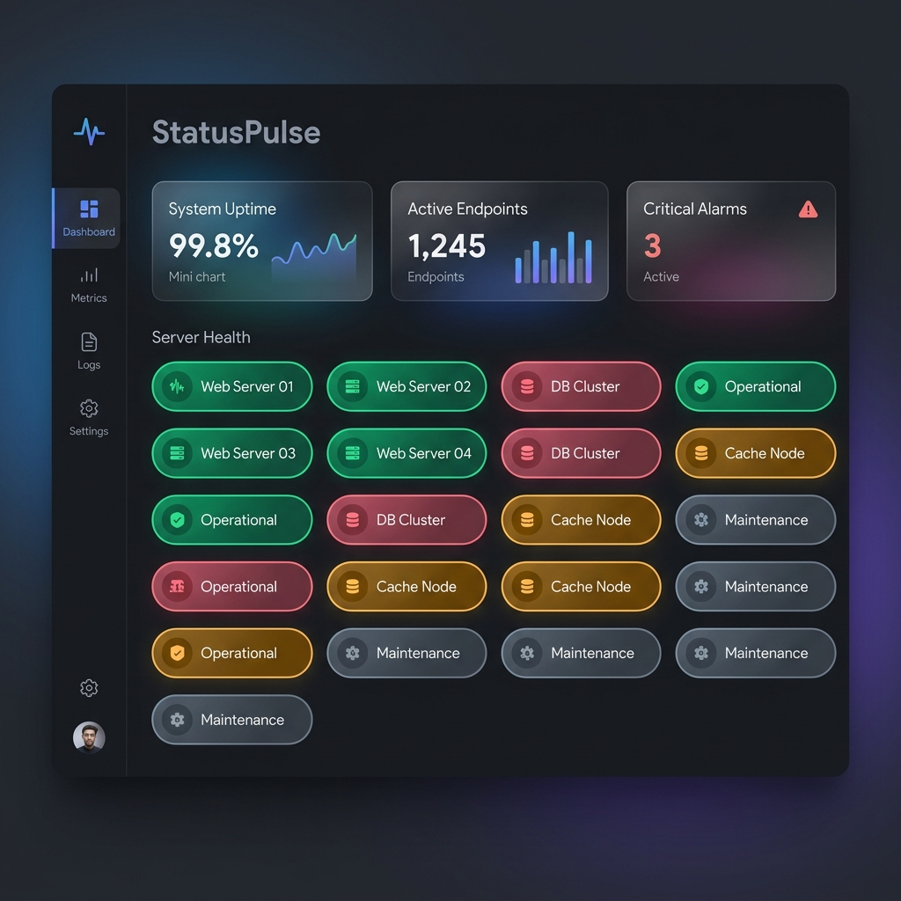

# 📊 StatusPulse: Advanced Bash-Driven Service Health Dashboard

<p align="center">
  
</p>

<p align="center">
  <a href="https://www.gnu.org/software/bash/">
    
  </a>
  <a href="https://developer.mozilla.org/en-US/docs/Web/HTML">
    
  </a>
  <a href="https://unlicense.org/">
    
  </a>
</p>

---

### 🌐 الوصف باللغة العربية (Arabic Description)
**StatusPulse** هو لوحة تحكم ومراقبة خفيفة الوزن وفائقة السرعة لمتابعة حالة الخدمات والتطبيقات البرمجية ونقاط النهاية (Endpoints). تم بناء المشروع بالكامل باستخدام سكربتات شيل Bash المتقدمة لتوليد رسومات شبكية تفاعلية بصيغة SVG تعبر عن استقرار الأنظمة على مدار اليوم، بالإضافة إلى واجهة مستخدم ويب (Web UI) عصرية وتفاعلية مصممة بتأثير الزجاج البلوري (Glassmorphism) والمظهر الداكن الأنيق، ودون الحاجة لأي قواعد بيانات أو إطارات عمل ثقيلة!

---

## 🚀 Key Features & Architectural Highlights

1. **Ultra-Lightweight & Zero DB Dependency**: Uses standard cron jobs and optimized Bash scripts to pull statuses and compile them directly into lightweight SVG HTML components.
2. **Premium Glassmorphic Dashboard**: A fully responsive dark-themed dashboard container styled with dynamic ambient gradients, custom Outfit/Inter typography, and glowing hover states.
3. **SVG Visual Grid**: Generates a timeline visualization where columns represent hours of the day (30-min granular steps) and rows represent target application endpoints.
4. **Dynamic Metrics Parser**: The parent web interface dynamically calculates uptime percentages, healthy nodes, and active failures in real time by parsing the SVG elements inside the display iframe!
5. **Compliant SVG Builder**: Safe grid-appending algorithms that remove and re-write trailing tags to ensure 100% syntactically valid W3C HTML/SVG output at all times.

---

## 🛠️ How It Works

1. **Daily Initialization (`indexcreator.sh`)**: Runs once a day (usually at `00:00`) to initialize the daily canvas (`today.html`), setup the SVG layout height, draw the horizontal timeline hours (00 to 23), and list the target component nodes.
2. **Status Audit Agent (`addtile.sh`)**: Runs at short regular intervals (e.g., every 30 mins) to pull response codes from the target server endpoints and append a visual, color-coded node (emerald green for pass, rose red for critical failure, amber for warning) inside the timeline canvas.
3. **Directory Bootstrapper (`dir_setup.sh`)**: Safely structures instances subfolders to organize multi-tenant configuration contexts.

---

## ⚙️ Quick Start Guide

### 1. Installation
Clone the repository and prepare the configurations:
```bash
git clone https://github.com/hamdyelbatal122/shell-Mon_Application.git
cd shell-Mon_Application
mkdir -p config
touch config/app.conf
```

### 2. Configure Your App Endpoints
Add your monitored components/application URLs inside `config/app.conf` in a clean `Component-Name,Url` format:
```text
Payment-Gateway,api.payment.example.com
Database-Cluster,db.cluster.example.com
Authentication-Service,auth.example.com/version.html
```

### 3. Initialize & Populate
Generate the template index canvas structure:
```bash
./indexcreator.sh a
```

To run status checkers manually:
```bash
./addtile.sh a
```

---

## ⏰ Cron Integration (Production Setup)

Automate StatusPulse by setting up standard Linux cron jobs. Run `crontab -e` and append the following configuration:

```text
# 1. Initialize the dashboard grid canvas daily at midnight (00:00)
0 0 * * * /absolute-path-to/shell-Mon_Application/indexcreator.sh a

# 2. Audit and update endpoint status tiles twice an hour (at the 1st and 31st minutes)
1,31 * * * * /absolute-path-to/shell-Mon_Application/addtile.sh a
```

*Note: Replace `/absolute-path-to/` with the absolute path of your workspace directory.*

---

## 📊 SVG Tile Colors & Status Tokens
* **🟢 Healthy Node (`.pass`)**: HTTP 200 OK received, version parsed successfully. Highlighting a glowing emerald hue (`#10b981`).
* **🔴 Critical Node (`.fail`)**: Connection timeout or error response received. Highlighting a glowing crimson hue (`#ef4444`).
* **🟡 Warning State (`.warn`)**: Intermittent parsing discrepancies or custom warning flags. Highlighting a amber hue (`#f59e0b`).
* **⚫ Pending State (`.status`)**: Scheduled slots awaiting execution. Neutral dark slate color (`#1e293b`).

---

## 📝 Roadmap & Future Enhancements
* [x] **Visual Redesign**: Sleek glassmorphic layout, Outfit typography, and custom ambient neon glows.
* [x] **Dynamic Real-time Uptime**: Automatic JS parser to calculate overall healthy/critical node metrics.
* [x] **W3C Valid SVG Generator**: Prevent SVG syntax breaks during cron appends.
* [ ] **Email Alerts Integration**: Optional alert dispatcher to notify operators instantly upon critical failures.
* [ ] **Interactive Hover Tooltips**: Advanced mouse-over card indicators directly inside the SVG frames.

---

## ⚖️ License
This project is dedicated to the public domain under the terms of the [Unlicense](LICENSE). You are free to copy, modify, compile, publish, and distribute this software for any purpose, commercial or non-commercial.
